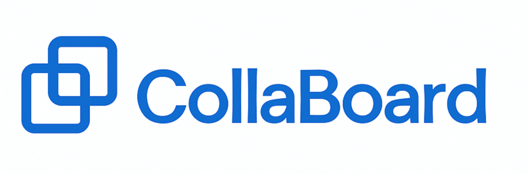
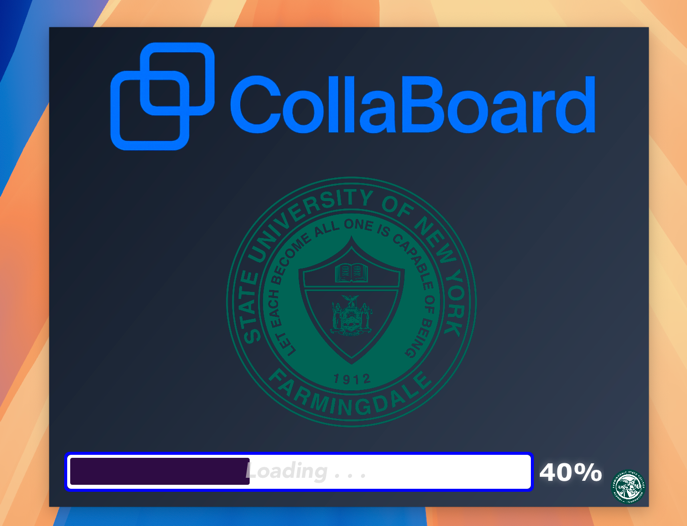
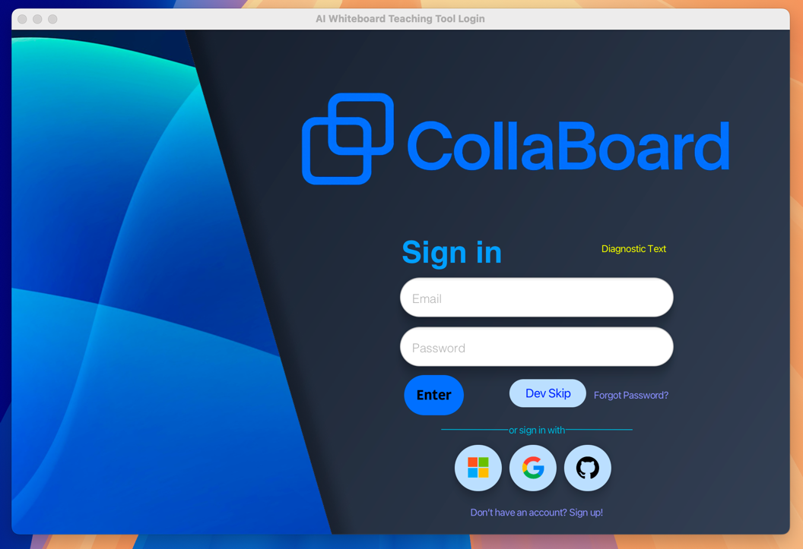
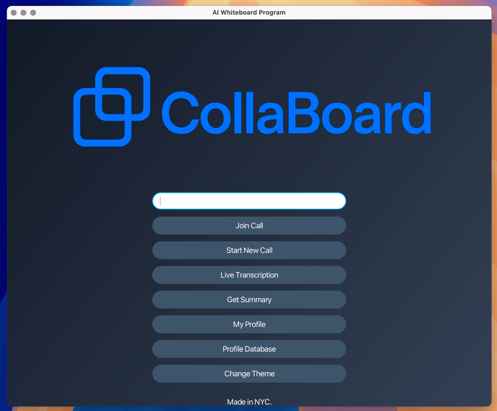
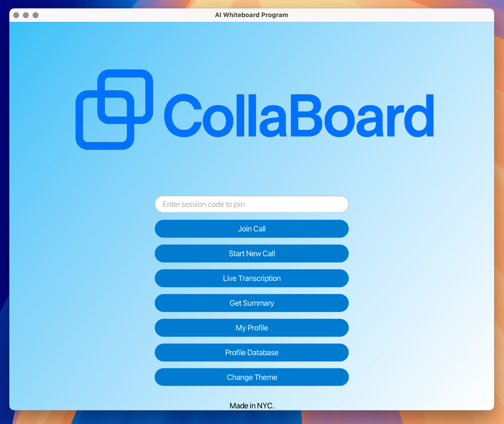
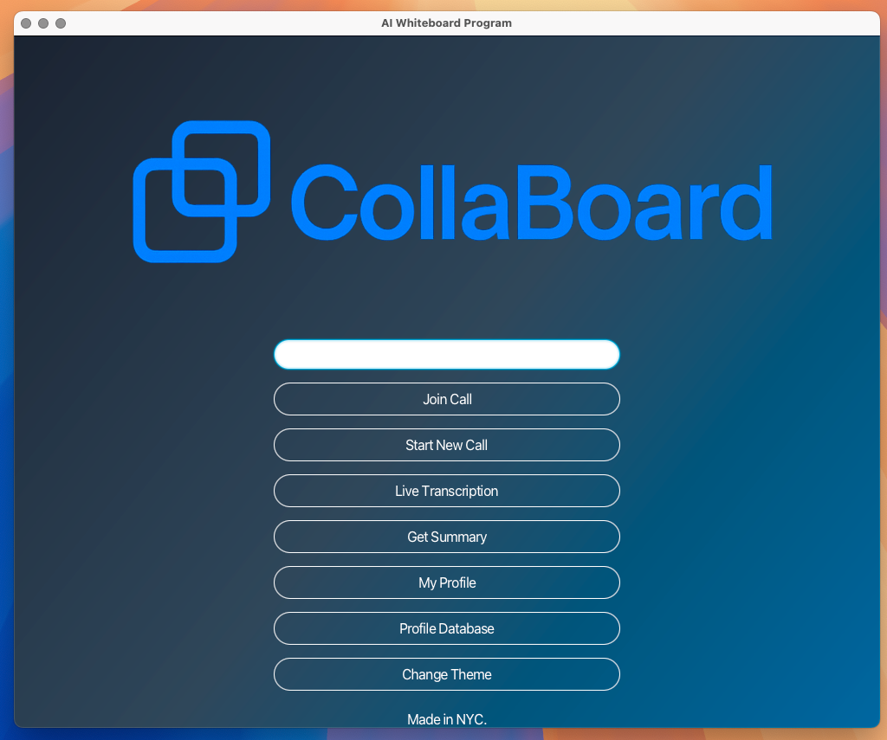
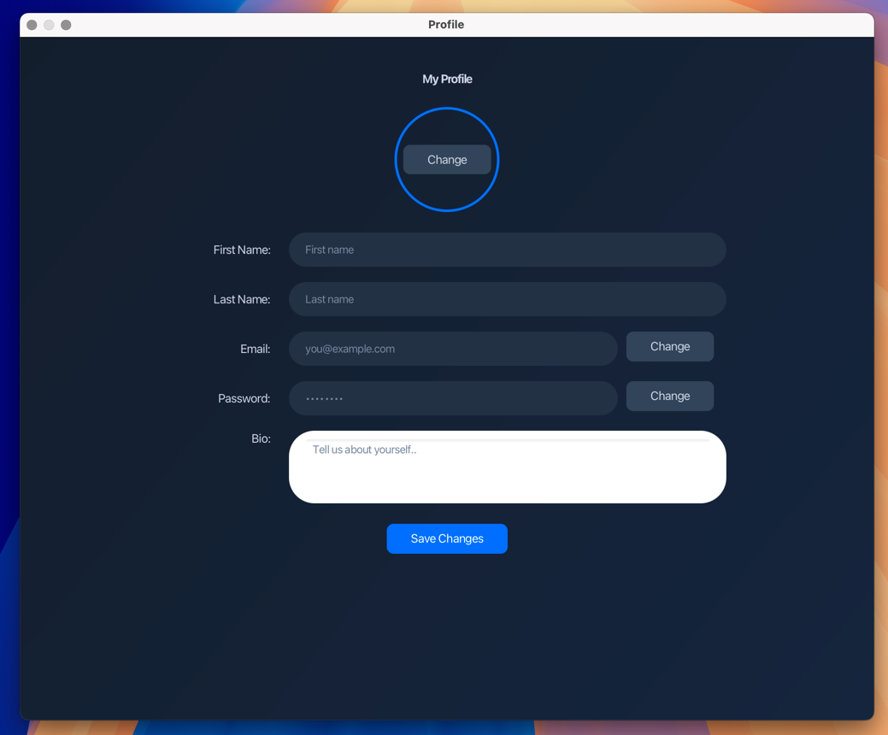
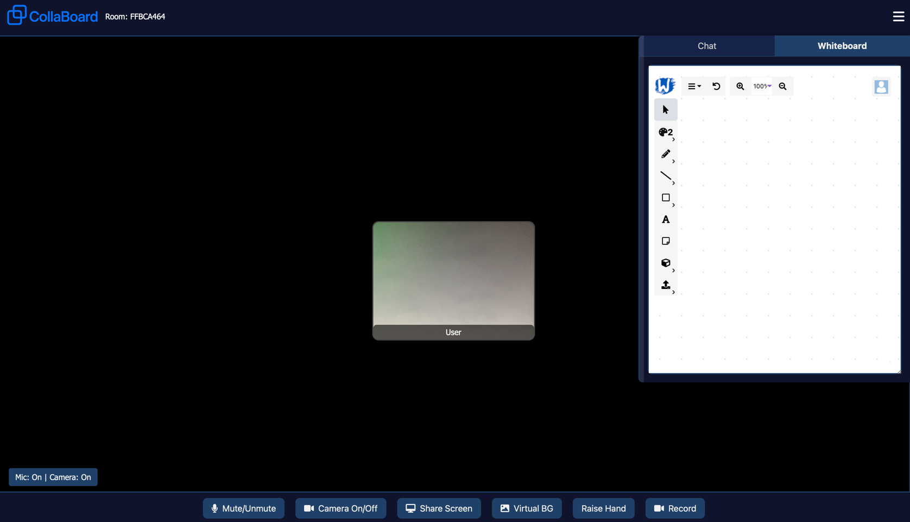

<p align="center">
  
</p>

<div align="center">


</div>


<p align="center">
  CollaBoard is a dynamic online learning platform that seamlessly integrates video conferencing and interactive whiteboards for real-time collaboration.
</p>

<div align="center">


</div>


<p align="center">
  
</p>

## 📚 Table of Contents
- [💬 Introduction](#-introduction)
- [🚀 Features](#-features)
- [▶️ Demo](#-demo)
- [🧰 Tech Stack](#-tech-stack)
- [📸 Images](#-images)
- [🛠️ Installation](#-installation)
- [🧪 Usage](#-usage)
- [⚙️ Configuration](#-configuration)
- [📁 Project Structure](#-project-structure)
- [📝 License](#-license)
- [❓FAQ](#faq)
- [📄 Documentation](#documentation)
- [👥 Contributors](#-contributors)
- [🙏 Acknowledgments](#-acknowledgments)

## 💬 Introduction
**ColaBoard** is an online learning collaborative platform that allows users to video chat and collaborate in
real time on a shared whiteboard. This product is designed to enhance learning in virtual classrooms and 
tutoring sessions. Users are also able to generate summarize of their learning session using Artificial Intelligence
and pay attention to real time speech to text captions. 

## 🚀 Features
- Real-time video chat between users	
- Interactive shared whiteboard	
- Simultaneous drawing, annotating, and text editing
- AI-powered session summaries using Google Gemini
- Real-time speech-to-text transcription	
- User authentication with session codes	
- Teacher and student controls 	
- Chat messaging system	
- Modern user interface	
- Splash screen loading
- Profile creation and personalization	
- Azure database connectivity
- User Authentication with Google, Microsoft, or GitHub (OAuth integration)
- User database with full CRUD application
- Database storage of account usernames and passwords
- Regular Expression Field Validation
- JSON parsing and serialization/deserialization
- PDF Generation of AI-powered summaries
- Dark mode and light mode

## ▶️ Demo

!!! INSERT YOUTUBE VIDEO HERE

## 🧰 Tech Stack

- **Java** – Core programming language for the application
- **JavaFX** – GUI framework used to build the user interface
- **Javascript** - Creates webpage for SignalR and WhiteBoardTeam API
- **CSS3** – Stylesheets for customizing the JavaFX user interface
- **Google Gemini** – AI model used to generate session summaries
- **Microsoft Azure Flexible Server** – Manages MySQL database hosting 
- **Microsoft Azure Speech Services** – Converts real-time to text
- **OAuth 2.0** – Authentication protocol used for secure user login and session authorization
- **MySQL** – Relational database for storing user profiles, transcripts, and session data
- **JBCrypt** - Adds secure password hashing
- **Java-doten** - Loads environmental variables from .env file
- **iText 7** - Creates PDF file of generated summary
- **Microsoft Authentication Library for Java** - Allows authentication with microsoft accounts 
- **WhiteBoard Team API** - Creates collaborative whiteboard interface
- **Azure SignalR** - Establishes real-time video chatting feature and learning session management
- **Azure Websites** - Allows for hosting of learning session


## 📸 Images








## 🛠️ Installation
### 1. Clone the repository
```bash
git clone https://github.com/d-jason32/AdvancedProgramming_Capstone_Project.git
cd your-repo
```
### 2. Set up your environment

- Java JDK 24
- JavaFX SDK
- Mavern
- Azure Flexible MySQL server
- Azure Speech Services
- SignalR
- Google Gemini

### 3. Run the project

```bash
mvn clean install
mvn javafx:run
```

## 🧪 Usage
### 1. Launch the application
Run this command:
```bash
mvn javafx:run
```
### 2. Log in or register
Use your credentials or create a new account to enter the system.

### 3. Join a session
Create a new learning session or enter a session code provided by the instructor.

### 4. Use core features
- Transcription: Speak while in a session to see real-time text
- AI Summary: After a learning session is over, use Google Gemini to generate a summary of the session
- Profile Database: Check the database to see all registered profiles

## ⚙️ Configuration
After installing the project, update API Keys:

### Required keys:
| Key                | Description                         |
|--------------------|-------------------------------------|
| `MYSQL_SERVER_URL` | JDBC URL to your MySQL database     |
| `DB_URL`           | Database name                       |
| `USERNAME`         | Your database username              |
| `PASSWORD`         | Your database password              |
| `AZURE_SPEECH_KEY` | Key for Azure Speech API            |
| `API_KEY`          | Google Gemini API Key               |
| `SIGNAL_R_API_KEY` | Key for SignalR video chat          |


## 📁 Project Structure
```plaintext
advancedprogramming_capstone_project/                        
├── src/
    └── main/
        ├── java/
        │   └── edu/farmingdale/advancedprogramming_capstone_project/
        │       ├── AI_Helper.java
        │       ├── CapstoneApp.java
        │       ├── ConnDbOps.java
        │       ├── DatabaseController.java
        │       ├── GeminiService.java
        │       ├── LoginController.java
        │       ├── MainController.java
        │       ├── Person.java
        │       ├── ProfileConnDbOps.java
        │       ├── ProfileController.java
        │       ├── SpeechToTextService.java
        │       ├── SplashScreenController.java
        │       ├── SummaryController.java
        │       └── TranscriptionController.java
        └── resources/
            └── edu/farmingdale/advancedprogramming_capstone_project/
                ├── fonts/                  
                ├── images/               
                ├── styling/               
                │   ├── database_styles.css
                │   ├── light_mode.css
                │   ├── login_page_styles.css
                │   ├── main_page_styles.css
                │   ├── profile.css
                │   ├── style.css
                │   └── video-style.css
                ├── config.properties      
                ├── database.fxml
                ├── login-screen.fxml
                ├── main.fxml
                ├── password-reset-screen.fxml
                ├── profilePage.fxml
                ├── splash-screen.fxml
                ├── SummaryView.fxml
                └── TranscriptionView.fxml
```
## 📝 License
- This project is licensed under the [MIT License](LICENSE). Feel free to use, modify, and distribute it as permitted.

## ❓FAQ
<details>
  <summary><strong>What does this project do?</strong></summary>
  <br>
  This project is a real-time collaboration tool for classrooms, allowing users to join sessions,
follow along with real time transcriptions, and generate session summaries. 
</details>

<details>
  <summary><strong>Does it support dark mode?</strong></summary>
  <br>
  Yes! Click the toggle in the main menu.
</details>

<details>
  <summary><strong>How do I sign in or make an account?</strong></summary>
  <br>
  In the login screen, you can sign in with GitHub or Google. To make an account,
follow the instructions for account creation.
</details>
<details>
  <summary><strong>How does the speech-to-text feature work?</strong></summary>
  <br>
  The app uses Azure Speech Services to convert microphone input into text in real time.
</details>
<details>
  <summary><strong>Is there support for multiple users?</strong></summary>
  <br>
  Yes. Teachers can create sessions and students can join using a session code. 
</details>


## 📄Documentation
[View the Documentation](https://docs.google.com/document/d/10x_jZji7rmwwhs27weYpYTUSRJXgX1Xg6gUanK9Tav0/edit?usp=sharing)

## 👥 Contributors

| [<br><sub>@Jason Devaraj</sub>](https://github.com/d-jason32) | [<br><sub>@Saim Sameer</sub>](https://github.com/sames007) | [<br><sub>@Yohangel Adames</sub>](https://github.com/Angel-Adames) | [<br><sub>@Milton Moses</sub>](https://github.com/Milton-Moses) | [<br><sub>@Obye Shaji</sub>](https://github.com/obyeshaji) |
|:-----------------------------------------------------------------------------------------------------------------------:|:---------------------------------------------------------------------------------------------------------------------:| :---: | :---: | :---: |

## 🙏 Acknowledgments

- Special thanks to **Dr. Moaath Alrajab** for his guidance and support throughout the development of this project.
